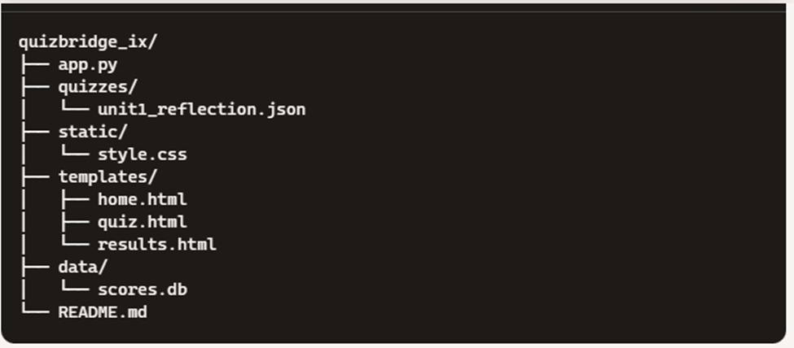

# QuizBridge IX Edition 🧠🎓

**QuizBridge IX** is a Flask-powered interactive web application designed for CBSE Class IX's Artificial Intelligence curriculum (Sub. Code 417). It enables students to take curated quizzes, receive real-time feedback, and visualize their performance through dynamic dashboards.

Built with ❤️ by [Jagdev Singh Dosanjh](https://github.com/jagdevdosanjh) & Copilot.

---

## ✨ Features

- 📚 Unit-wise quizzes aligned with AI curriculum
- ✅ Real-time answer validation with explanations
- 🧠 Dashboard with Chart.js to visualize scores
- 🧩 JSON-based quiz loader for easy expansion
- 🖨️ Print-friendly result summaries (planned)
- 🔐 (Upcoming) Admin panel for score export and quiz upload

---

## 🗂️ Project Structure



quizbridge_ix/ ├── app.py # Main Flask app ├── quizzes/ # Folder for quiz JSON files │ └── unit1_reflection.json ├── templates/ # HTML templates (Jinja2) │ ├── home.html │ ├── quiz.html │ ├── results.html │ └── dashboard.html ├── static/ # CSS styling │ └── style.css ├── venv/ # Virtual environment (not uploaded to version control) └── requirements.txt # Flask dependency


---

## 🚀 Getting Started

## 1. Clone the repository

```bash
git clone https://github.com/your-username/quizbridge_ix.git
cd quizbridge_ix

##  2. Create a virtual environment

python -m venv venv

Activate it:

PowerShell: .\venv\Scripts\Activate.ps1

CMD: venv\Scripts\activate.bat

Unix/Mac: source venv/bin/activate

3. Install dependencies

pip install -r requirements.txt

4. Run the app
python app.py

Visit: http://127.0.0.1:5000

## 📊 Adding New Quizzes
Drop new JSON files into the /quizzes/ folder using this format:
{
  "title": "Quiz Title",
  "type": "quiz",
  "quiz": [
    {
      "question": "Your question text?",
      "options": ["Option 1", "Option 2", "Option 3", "Option 4"],
      "answer": [1],
      "explanation": "Why the correct answer is right.",
      "type": "singleSelect"
    }
  ]
}

Link them in home.html like:
<a href="{{ url_for('quiz', unit='your_filename_without_extension') }}">Start</a>

💡 Credits & Acknowledgements
This project is inspired by the CBSE AI Curriculum (2024–25), with quiz content, UX logic, and performance dashboards carefully crafted to support Indian classrooms and beyond.

“We don’t just quiz. We Wau™️.” 🌀

📜 License
MIT License — free for education, remix, and redistribution.

---

Let me know if you'd like me to auto-generate a custom `unit2_data_literacy.json` or help publish this to GitHub or Render with deployment configs. Your platform's got real shine now ✨
